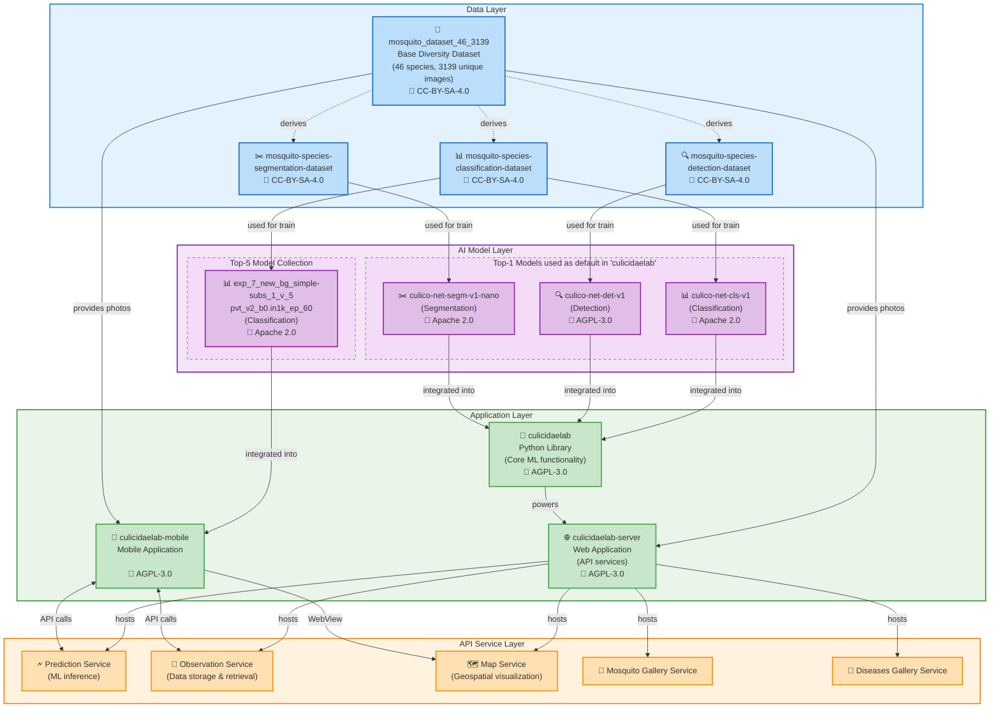

<div align="center">

# Mosquito Tracking & Analysis Platform

</div>

<p align="center"> <a href="https://github.com/astral-sh/ruff"></a>  <a href="https://deepwiki.com/iloncka-ds/culicidaelab-server"></a>
</p>

---

CulicidaeLab Server is a comprehensive web platform for mosquito research, surveillance, and data analysis. It combines a Python-based backend API (FastAPI) with a dynamic frontend (Solara) to provide tools for species prediction, data visualization, and information retrieval related to mosquitoes and vector-borne diseases.

## CulicidaeLab Ecosystem Architecture



An open-source system for mosquito research and analysis includes components:

- **Data**:

    - Base [diversity dataset (46 species, 3139 images](https://huggingface.co/datasets/iloncka/mosquito_dataset_46_3139) under CC-BY-SA-4.0 license.
    - Specialized derivatives: [classification](https://huggingface.co/datasets/iloncka/mosquito-species-classification-dataset), [detection](https://huggingface.co/datasets/iloncka/mosquito-species-detection-dataset), and [segmentation](https://huggingface.co/datasets/iloncka/mosquito-species-segmentation-dataset) datasets under CC-BY-SA-4.0 licenses.

- **Models**:

    - Top-1 models (see reports), used as default by `culicidaelab` library: [classification (Apache 2.0)](https://huggingface.co/iloncka/culico-net-cls-v1), [detection (AGPL-3.0)](https://huggingface.co/iloncka/culico-net-det-v1), [segmentation (Apache 2.0)](https://huggingface.co/iloncka/culico-net-segm-v1-nano)
    - [Top-5 classification models collection](https://huggingface.co/collections/iloncka/mosquito-classification-17-top-5-68945bf60bca2c482395efa8) with accuracy >90% for 17 mosquito species.

- **Protocols**:

    All training parameters and metrics available at:

    - [Detection model reports](https://gitlab.com/mosquitoscan/experiments-reports-detection-models)
    - [Segmentation model reports](https://gitlab.com/mosquitoscan/experiments-reports-segmentation-models)
    - [Classification experiment reports - 1st round](https://gitlab.com/iloncka/mosal-reports)
    - [Classification experiment reports - 2nd round](https://gitlab.com/mosquitoscan/experiments-reports)

- **Applications**:

    - [Python library (AGPL-3.0)](https://github.com/iloncka-ds/culicidaelab) providing core ML functionality
    - [Web server (AGPL-3.0)](https://github.com/iloncka-ds/culicidaelab-server) hosting API services
    - Mobile apps (AGPL-3.0): [mosquitoscan](https://gitlab.com/mosquitoscan/mosquitoscan-app) for independent use with optimized models and [culicidaelab-mobile](https://gitlab.com/iloncka-ds/culicidaelab-mobile) for educational and research purposes as part of the CulicidaeLab Ecosystem.

These components form a cohesive ecosystem where datasets used for training models that power applications, the Python library provides core functionality to the web server, and the server exposes services consumed by the mobile application. All components are openly licensed, promoting transparency and collaboration.

This integrated approach enables comprehensive mosquito research, from data collection to analysis and visualization, supporting both scientific research and public health initiatives.

## ✨ Key Features of `culicidaelab-server`

* **AI-Powered Species Prediction:** Upload mosquito images for species identification.
* **Interactive Map Visualization:** Explore mosquito distribution and observations on a map.
* **Species Database:** Access detailed information about various mosquito species.
* **Disease Information Hub:** Learn about mosquito-borne diseases, their vectors, symptoms, and prevention.

## Practical Applications of the `culicidaelab-server`

-   **Control and Monitoring Centers:**

    -   **Data Aggregation:** Collecting and visualizing all data from the mobile app and other sources on an interactive map.
    -   **Analytical Dashboard:** Providing epidemiologists and public health authorities with a tool to analyze population dynamics, identify hotspots, and assess risks.

-   **Planning and Decision-Making:**

    -   **Resource Optimization:** City and regional authorities can use the hotspot map to plan and conduct targeted treatments of areas, saving resources and reducing environmental impact.
    -   **Effectiveness Assessment:** Analyzing data before and after mosquito control interventions to evaluate their effectiveness.

-   **Public Information Portal:**

    -   An open map that informs citizens about the epidemiological situation in their region.

## 🔧Requirements

### Hardware Requirements

**Processor (CPU):** Any modern x86-64 CPU.

**Memory (RAM):** Minimum 2 GB. 8 GB or more is recommended for processing large datasets or using more complex models.

**Graphics Card (GPU):** An NVIDIA GPU with CUDA support is highly recommended for a significant performance increase in deep learning model operations, especially for detection and segmentation but not essential for classification (see [`culicidaelab` library performance logs](https://github.com/iloncka-ds/culicidaelab/tree/main/tests/performance/performance_logs), [performance reports of `culicidaelab-server`](https://github.com/iloncka-ds/culicidaelab-server/tree/main/tests/performance_reports) ang [notebook](https://colab.research.google.com/drive/1JdfxSQmtrJND4mNUctOkY7Kt0yvbO0eV?usp=sharing)). For the SAM model, a GPU is virtually essential for acceptable performance. Minimum video memory is 2 GB; 4 GB or more is recommended.

**Hard Drive:** At least 10 GB of free space to install the library, dependencies, download pre-trained models, and store processed data.

### Software Requirements

**Operating Systems (tested):**

  - Windows 10/11
  - Linux 22.04+

**Software:**

  - for Linux needed libgl1 package to be installed
  - Git
  - Python 3.11
  - uv 0.8.13

**Python packages:**

  **Backend:**
  * FastAPI: High-performance web framework for building APIs.
  * Uvicorn: ASGI server.
  * LanceDB: Vector database for efficient similarity search and data storage.

  **Frontend:**
  * Solara: Pure Python web framework for building reactive web applications.
  * ipyleaflet - map components for Solara.

  **Data Formats:**
  * JSON, GeoJSON

    Full list of requirements: [pyproject.toml](https://github.com/iloncka-ds/culicidaelab/blob/main/pyproject.toml)

## 🚀 Getting Started

### Installation & Setup

1. **Clone the repository:**

```bash
git clone https://github.com/iloncka-ds/culicidaelab-server.git
cd culicidaelab-server
```

2. **Install dependencies with pip:**

```bash
python -m venv .venv
source .venv/bin/activate
# On Windows: .venv\Scripts\activate
python -m pip install -e .
python -m pip cache purge
```

**Note:** If you are using uv, you can install dependencies with [uv](https://docs.astral.sh/uv/):

```bash
uv venv -p 3.11
source .venv/bin/activate
# On Windows: .venv\Scripts\activate
uv sync -p 3.11
uv pip install -e .
uv cache clean
```

3. **Generate Sample Data:**

This script creates the JSON/GeoJSON files that the backend's `initialize_db` script might use, and that the frontend might load directly or via the API.

```bash
python -m backend.data.sample_data.generate_sample_data
```

This will create files like `sample_species.json`, `sample_observations.geojson`, etc., in the `sample_data/` directory.

4. **Initialize the Backend Database:**

This script sets up LanceDB tables and populates them using the generated sample JSON files.
*(Ensure the paths in `backend/scripts/initialize_db.py` point to the correct location of `sample_species.json` and `sample_diseases.json`, likely `../sample_data/` if run from `backend/scripts/` or adjusted accordingly).*

```bash
python -m backend.scripts.populate_lancedb
```

Check if generation successful by checking the LanceDB database.

```bash
python -m backend.scripts.query_lancedb observations --limit 5
```

#### Running the Application

1. **Run the Backend API Server:**
    Navigate to the project root (or ensure paths in `uvicorn` command are correct).

```bash
cd culicidaelab-server
source .venv/bin/activate
# On Windows: .venv\Scripts\activate
uvicorn backend.main:app --port 8000 --host 127.0.0.1
```

The API will be accessible at `http://localhost:8000`.
    * Swagger UI: `http://localhost:8000/docs`
    * ReDoc: `http://localhost:8000/redoc`

2. **Run the Frontend Application:**

    In a new terminal, navigate to the project root.

```bash
cd culicidaelab-server
source .venv/bin/activate
# On Windows: .venv\Scripts\activate
solara run frontend.main
```

The frontend application will be accessible at `http://localhost:8765` (or the port Solara defaults to/you specify).

## Deployment

Application can be deployed on any server with minimal configuration (see [docs/en/deployment/production.md](https://github.com/iloncka-ds/culicidaelab-server/blob/main/docs/en/deployment/production.md)).
Visit [http://culicidaelab.ru](http://culicidaelab.ru) to see the application in action.

## 🤝 Contributing

Contributions are what make the open-source community such an amazing place to learn, inspire, and create. Any contributions you make are **greatly appreciated**.

Please see our **[Contributing Guide](https://github.com/iloncka-ds/culicidaelab-server/blob/main/CONTRIBUTING.md)** for details on our code of conduct, development setup, and the pull request process.

## 📜 License

This project is licensed under the AGPL-3.0 License - see the [LICENSE](https://github.com/iloncka-ds/culicidaelab-server/blob/main/LICENSE) file for details.

## 🙏 Acknowledgments

CulicidaeLab development is  supported by a grant from the [**Foundation for Assistance to Small Innovative Enterprises (FASIE)**](https://fasie.ru/).
