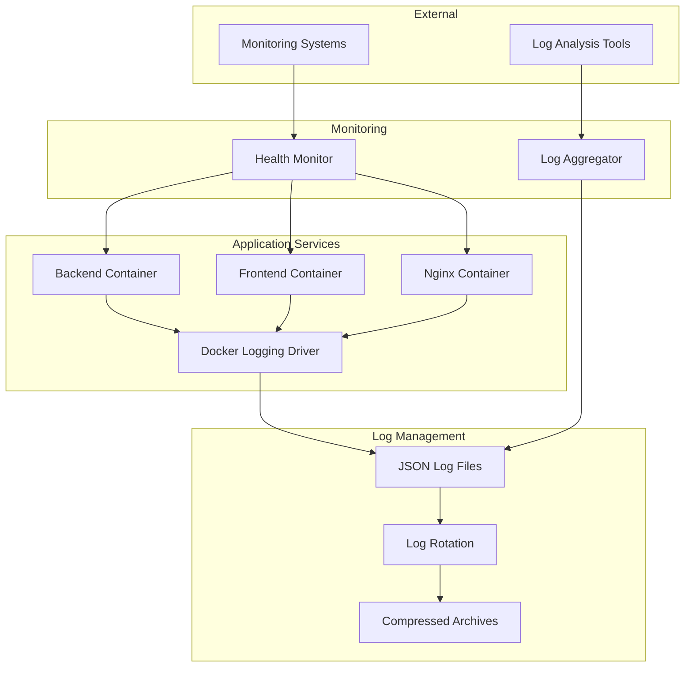

# Logging and Monitoring Configuration

This document describes the logging and monitoring setup for the CulicidaeLab Docker deployment.

## Overview

The logging and monitoring system provides:

- **Structured JSON logging** for all services
- **Centralized log aggregation** with Docker logging drivers
- **Log rotation and retention** policies
- **Health check endpoints** for all services
- **Monitoring scripts** for service health tracking
- **Log analysis tools** for debugging and troubleshooting

## Architecture



## Service Configuration

### Backend Logging

The backend uses structured JSON logging with the following features:

- **JSON formatter** for structured log output
- **Multiple log levels** (DEBUG, INFO, WARNING, ERROR, CRITICAL)
- **Contextual logging** with additional metadata
- **Health check endpoint** at `/api/health`

**Configuration**: `backend/logging_config.py`

**Environment Variables**:
- `FASTAPI_ENV`: Environment mode (development/production)
- `DEBUG`: Enable debug logging (true/false)

**Health Endpoint Response**:
```json
{
  "status": "ok",
  "timestamp": 1640995200.0,
  "service": "culicidaelab-backend",
  "version": "1.0.0",
  "system": {
    "cpu_percent": 15.2,
    "memory_percent": 45.8,
    "disk_percent": 23.1
  },
  "caches_loaded": true
}
```

### Frontend Logging

The frontend provides a simple health check endpoint:

- **Health check endpoint** at `/health`
- **JSON response format** for monitoring compatibility
- **Environment detection** for development/production modes

**Health Endpoint Response**:
```json
{
  "status": "ok",
  "timestamp": 1640995200.0,
  "service": "culicidaelab-frontend",
  "version": "1.0.0",
  "environment": "false"
}
```

### Nginx Logging

Nginx uses structured JSON logging with the following features:

- **JSON access logs** with request metadata
- **Error logging** with appropriate levels
- **Health check endpoint** at `/health`
- **Request timing** and upstream information

**Log Format**:
```json
{
  "timestamp": "2024-01-01T12:00:00+00:00",
  "remote_addr": "192.168.1.100",
  "request": "GET /api/health HTTP/1.1",
  "status": "200",
  "body_bytes_sent": "156",
  "request_time": "0.045",
  "upstream_addr": "172.20.0.2:8000",
  "upstream_status": "200",
  "upstream_response_time": "0.042",
  "service": "nginx",
  "environment": "production"
}
```

## Docker Compose Logging Configuration

### Production Environment

```yaml
logging:
  driver: "json-file"
  options:
    max-size: "10m"
    max-file: "3"
    labels: "service,environment"
labels:
  - "service=backend"
  - "environment=production"
```

### Development Environment

```yaml
logging:
  driver: "json-file"
  options:
    max-size: "50m"
    max-file: "2"
    labels: "service,environment"
labels:
  - "service=backend"
  - "environment=development"
```

## Log Rotation and Retention

### Production Settings

- **Max log size**: 10MB per file
- **Max files**: 3 files per service
- **Total retention**: ~30MB per service
- **Compression**: Automatic for rotated logs

### Development Settings

- **Max log size**: 50MB per file
- **Max files**: 2 files per service
- **Total retention**: ~100MB per service
- **Compression**: Disabled for easier debugging

### System-level Rotation

The `setup_logging.sh` script configures system-level log rotation:

```bash
# Nginx logs - daily rotation, 14 days retention
/var/log/culicidaelab/nginx/*.log {
    daily
    rotate 14
    compress
    delaycompress
}

# Docker container logs - daily rotation, 7 days retention
/var/lib/docker/containers/*/*.log {
    daily
    rotate 7
    compress
    maxsize 100M
}
```

## Monitoring Tools

### Health Monitor Script

**Location**: `scripts/health_monitor.py`

**Features**:
- Check health of all services
- Continuous monitoring mode
- JSON output format
- Configurable check intervals
- Timeout handling

**Usage**:
```bash
# Single health check
python3 scripts/health_monitor.py --single

# Continuous monitoring (30s intervals)
python3 scripts/health_monitor.py --interval 30

# Monitor specific URL
python3 scripts/health_monitor.py --base-url https://example.com
```

**Output Example**:
```json
{
  "timestamp": "2024-01-01T12:00:00Z",
  "overall_status": "healthy",
  "services": [
    {
      "service": "nginx",
      "status": "healthy",
      "response_time": 15.2,
      "http_status": 200,
      "details": {
        "status": "ok",
        "service": "nginx",
        "environment": "production"
      }
    }
  ]
}
```

### Log Aggregator Script

**Location**: `scripts/log_aggregator.py`

**Features**:
- Aggregate logs from all Docker containers
- Parse JSON and plain text logs
- Color-coded output by log level
- Service filtering
- Real-time log following

**Usage**:
```bash
# Follow all service logs
python3 scripts/log_aggregator.py

# Follow specific services
python3 scripts/log_aggregator.py -s backend frontend

# Show logs for specific service
python3 scripts/log_aggregator.py --service backend --lines 50

# Use production compose file
python3 scripts/log_aggregator.py -f docker-compose.prod.yml
```

## Production Setup

### 1. Install Logging Infrastructure

```bash
# Run as root
sudo bash scripts/setup_logging.sh
```

This script:
- Creates log directories
- Sets up log rotation
- Configures systemd services
- Creates monitoring timers
- Installs helper commands

### 2. Available Commands

After setup, the following commands are available:

```bash
# Follow all logs
culicidaelab-logs follow

# Check service health
culicidaelab-logs health

# Follow nginx logs only
culicidaelab-logs nginx

# Show recent errors
culicidaelab-logs errors

# Show log statistics
culicidaelab-logs stats
```

### 3. Systemd Services

- **culicidaelab-health-check.timer**: Runs health checks every 5 minutes
- **culicidaelab-log-monitor.service**: Continuous log monitoring (optional)

## Log Analysis

### Viewing Logs

```bash
# Docker Compose logs
docker-compose -f docker-compose.prod.yml logs -f

# Individual service logs
docker logs culicidaelab_backend_prod -f

# System logs
journalctl -u docker.service -f

# Nginx access logs
tail -f /var/log/culicidaelab/nginx/access.log
```

### Parsing JSON Logs

```bash
# Pretty print JSON logs
docker logs culicidaelab_backend_prod | jq '.'

# Filter by log level
docker logs culicidaelab_backend_prod | jq 'select(.level == "ERROR")'

# Extract specific fields
docker logs culicidaelab_nginx_prod | jq '{timestamp, status, request_time}'
```

### Log Queries

```bash
# Find errors in the last hour
journalctl --since "1 hour ago" | grep -i error

# Count requests by status code
cat /var/log/culicidaelab/nginx/access.log | jq -r '.status' | sort | uniq -c

# Average response time
cat /var/log/culicidaelab/nginx/access.log | jq -r '.request_time' | awk '{sum+=$1; count++} END {print sum/count}'
```

## Troubleshooting

### Common Issues

1. **Logs not appearing**:
   - Check Docker logging driver configuration
   - Verify container is running: `docker ps`
   - Check disk space: `df -h`

2. **Health checks failing**:
   - Verify service is responding: `curl http://localhost/health`
   - Check container logs: `docker logs <container_name>`
   - Verify network connectivity between containers

3. **Log rotation not working**:
   - Check logrotate configuration: `logrotate -d /etc/logrotate.d/culicidaelab-*`
   - Verify permissions on log directories
   - Check system cron jobs: `systemctl status cron`

### Debug Commands

```bash
# Check container health
docker inspect culicidaelab_backend_prod | jq '.[0].State.Health'

# View container resource usage
docker stats

# Check log file sizes
du -sh /var/log/culicidaelab/*

# Test log rotation
sudo logrotate -f /etc/logrotate.d/culicidaelab-nginx
```

## Integration with External Systems

### Prometheus Metrics

The health endpoints can be scraped by Prometheus:

```yaml
# prometheus.yml
scrape_configs:
  - job_name: 'culicidaelab'
    static_configs:
      - targets: ['localhost:80']
    metrics_path: '/health'
    scrape_interval: 30s
```

### ELK Stack Integration

Logs can be shipped to Elasticsearch using Filebeat:

```yaml
# filebeat.yml
filebeat.inputs:
- type: log
  paths:
    - /var/log/culicidaelab/nginx/*.log
  json.keys_under_root: true
  json.add_error_key: true
```

### Grafana Dashboards

Create dashboards using:
- Health check metrics from Prometheus
- Log data from Elasticsearch
- Docker container metrics

## Security Considerations

1. **Log Sanitization**: Ensure no sensitive data is logged
2. **Access Control**: Restrict access to log files and monitoring endpoints
3. **Log Integrity**: Consider log signing for critical environments
4. **Network Security**: Secure monitoring endpoints with authentication
5. **Data Retention**: Follow compliance requirements for log retention
