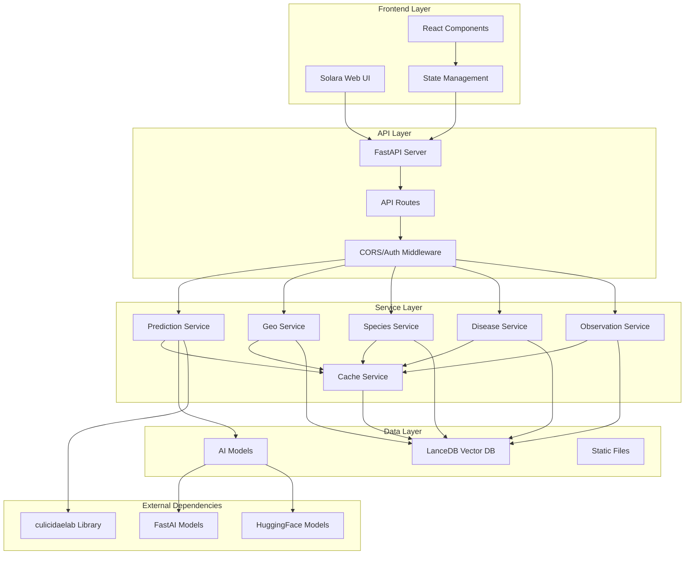
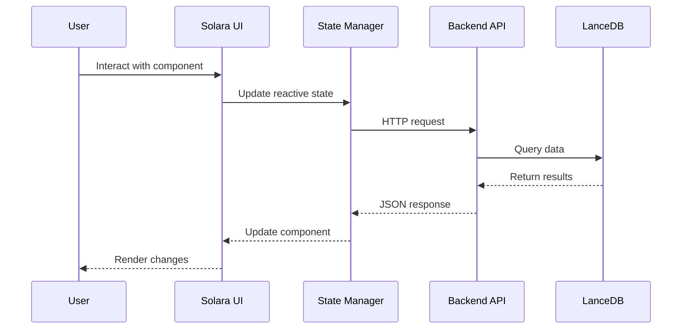
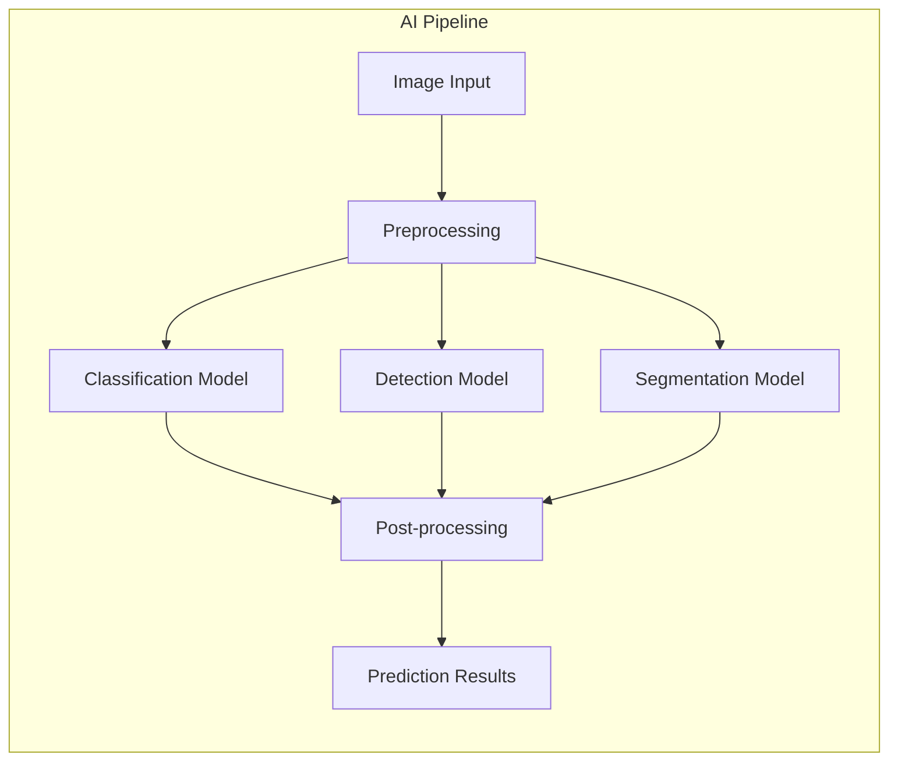
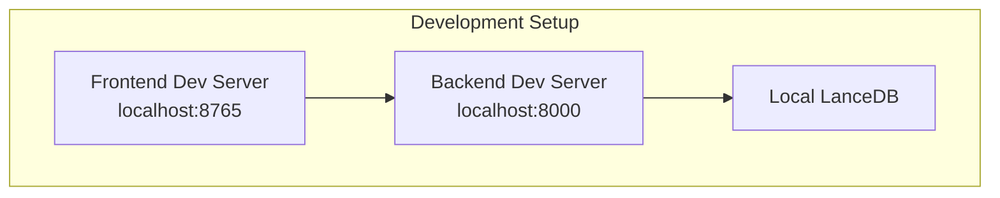
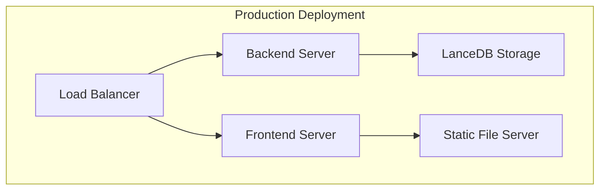

# System Architecture

This document provides a comprehensive overview of the CulicidaeLab Server architecture, including system components, data flow, and technical design decisions.

## Overview

CulicidaeLab Server is a full-stack web application built with modern Python technologies, designed for mosquito research, surveillance, and data analysis. The system follows a microservices-inspired architecture with clear separation between frontend and backend components.

## High-Level Architecture



## Component Architecture

### Frontend Architecture (Solara)

The frontend is built using Solara, a pure Python reactive web framework that compiles to modern web technologies.

#### Key Components:

- **Main Application** (`frontend/main.py`): Entry point and routing configuration
- **Pages** (`frontend/pages/`): Individual page components for different features
- **Components** (`frontend/components/`): Reusable UI components organized by feature
- **State Management** (`frontend/state.py`): Global application state using Solara reactives
- **Configuration** (`frontend/config.py`): Frontend settings, themes, and API endpoints

#### Frontend Data Flow:



### Backend Architecture (FastAPI)

The backend follows a layered architecture pattern with clear separation of concerns.

#### Layer Structure:

1. **API Layer** (`backend/routers/`): FastAPI route handlers
2. **Service Layer** (`backend/services/`): Business logic and data processing
3. **Schema Layer** (`backend/schemas/`): Pydantic models for request/response validation
4. **Data Layer** (`backend/database_utils/`): Database connection and query utilities

#### Backend Components:

- **Main Application** (`backend/main.py`): FastAPI app initialization and configuration
- **Configuration** (`backend/config.py`): Settings management with Pydantic
- **Dependencies** (`backend/dependencies.py`): Dependency injection for common services
- **Routers**: Feature-specific API endpoints
  - `species.py`: Species information and search
  - `diseases.py`: Disease data and vector relationships
  - `prediction.py`: AI-powered species prediction
  - `geo.py`: Geographic data and observations
  - `observation.py`: User observation management
  - `filters.py`: Filter options for UI components

### Data Architecture

#### LanceDB Vector Database

The system uses LanceDB as the primary data store, providing:

- **Vector similarity search** for species identification
- **Geospatial indexing** for location-based queries
- **Schema evolution** support for data model changes
- **High-performance queries** with automatic indexing

#### Data Models:

```python
# Core data structures
Species {
    id: str
    scientific_name: str
    common_names: dict[str, str]
    description: dict[str, str]
    images: list[str]
    distribution: dict
    vector_embedding: list[float]
}

Observation {
    id: str
    species_id: str
    location: Point
    timestamp: datetime
    confidence: float
    user_id: str
    image_path: str
}

Disease {
    id: str
    name: dict[str, str]
    description: dict[str, str]
    symptoms: dict[str, str]
    vectors: list[str]
    prevention: dict[str, str]
}
```

## AI/ML Integration

### Model Architecture

The system integrates with the `culicidaelab` library for AI-powered species identification:



### Model Types:

1. **Classification Models**: Species identification from images
2. **Detection Models**: Mosquito detection and localization
3. **Segmentation Models**: Precise mosquito boundary detection

### Performance Considerations:

- **GPU Acceleration**: CUDA support for faster inference
- **Model Caching**: Pre-loaded models for reduced latency
- **Batch Processing**: Efficient handling of multiple predictions
- **Fallback Mechanisms**: CPU processing when GPU unavailable

## Security Architecture

### Authentication & Authorization

Currently implements basic security measures:

- **CORS Configuration**: Controlled cross-origin access
- **Input Validation**: Pydantic schema validation
- **File Upload Security**: Image type and size validation
- **Rate Limiting**: (Planned) API request throttling

### Data Security

- **Input Sanitization**: All user inputs validated
- **SQL Injection Prevention**: Parameterized queries via LanceDB
- **File System Security**: Controlled file access patterns
- **Environment Variables**: Sensitive configuration externalized

## Deployment Architecture

### Development Environment



### Production Environment



## Performance Considerations

### Frontend Performance

- **Component Lazy Loading**: On-demand component loading
- **State Optimization**: Efficient reactive state updates
- **Asset Optimization**: Compressed images and static files
- **Caching Strategy**: Browser and CDN caching

### Backend Performance

- **Database Indexing**: Optimized LanceDB indexes
- **Connection Pooling**: Efficient database connections
- **Async Processing**: Non-blocking I/O operations
- **Response Caching**: Cached API responses for static data

### Monitoring & Observability

- **Application Logs**: Structured logging throughout the system
- **Performance Metrics**: Response time and throughput monitoring
- **Error Tracking**: Comprehensive error logging and alerting
- **Health Checks**: System health monitoring endpoints

## Technology Stack Summary

### Frontend Stack
- **Solara**: Pure Python web framework
- **ipyleaflet**: Interactive mapping components
- **Plotly**: Data visualization
- **Material Design**: UI component library

### Backend Stack
- **FastAPI**: High-performance web framework
- **Uvicorn**: ASGI server
- **Pydantic**: Data validation and settings
- **LanceDB**: Vector database
- **culicidaelab**: AI/ML library

### Development Tools
- **uv**: Python package management
- **pytest**: Testing framework
- **Black**: Code formatting
- **mypy**: Type checking
- **pre-commit**: Git hooks for code quality