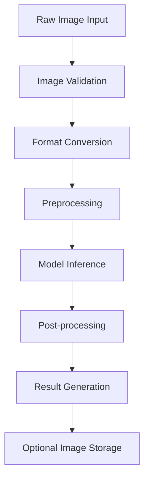

# AI Models

This document provides comprehensive documentation of the AI model architecture and prediction pipeline used in the CulicidaeLab Server for mosquito species identification.

## Overview

CulicidaeLab employs a sophisticated machine learning pipeline for automated mosquito species identification from images. The system integrates the `culicidaelab` Python library (version ≥0.2.2) with FastAI (version 2.7.0-2.8.0) to provide accurate, real-time species classification.

## Model Architecture

### MosquitoClassifier

The core AI component is the `MosquitoClassifier` class from the culicidaelab library, which provides:

- **Deep Learning Framework**: Built on FastAI for robust image classification
- **Pre-trained Models**: Leverages transfer learning from established computer vision models
- **Species-Specific Training**: Trained on curated mosquito image datasets
- **Confidence Scoring**: Provides probability distributions across species classes

### Model Configuration

```python
class PredictionService:
    def __init__(self):
        self.model = None
        self.model_loaded = False
        self.lib_settings = get_settings()
        self.save_predicted_images_enabled = app_settings.SAVE_PREDICTED_IMAGES
```

#### Key Configuration Parameters:
- **Model Architecture**: Configurable via `predictors.classifier.model_arch` setting
- **Model Weights**: Loaded from `predictors.classifier.filename` path
- **Input Processing**: Automatic image preprocessing and normalization
- **Output Format**: Structured prediction results with confidence scores

## Prediction Pipeline

### Image Processing Workflow



### 1. Image Input and Validation

```python
async def predict_species(self, image_data: bytes, filename: str):
    """Process image data for species prediction."""
    image = Image.open(io.BytesIO(image_data)).convert("RGB")
    image_np = np.array(image)
```

**Input Requirements:**
- **Supported Formats**: JPEG, PNG, and other PIL-compatible formats
- **Color Space**: Automatic conversion to RGB
- **Size Limits**: Configurable maximum image dimensions
- **Quality**: No specific quality requirements (model handles various qualities)

### 2. Preprocessing Pipeline

The preprocessing pipeline includes:

- **Color Space Normalization**: RGB conversion and channel normalization
- **Resizing**: Automatic scaling to model input dimensions
- **Data Augmentation**: Runtime augmentation for improved robustness
- **Tensor Conversion**: NumPy array to model-compatible format

### 3. Model Inference

```python
predictions = self.model.predict(image_np)
top_species, top_confidence = predictions[0]
```

**Inference Process:**
- **Forward Pass**: Single inference through the neural network
- **Probability Distribution**: Softmax output across all species classes
- **Top-K Results**: Returns ranked predictions with confidence scores
- **Performance**: Optimized for real-time inference (< 1 second typical)

### 4. Result Processing

```python
result = PredictionResult(
    scientific_name=top_species,
    probabilities={species: float(conf) for species, conf in predictions[:2]},
    id=species_id,
    model_id=self.model_id,
    confidence=float(top_confidence),
    image_url_species=image_url_species,
)
```

## Model Performance

### Accuracy Metrics

The model performance is evaluated using standard classification metrics:

- **Top-1 Accuracy**: Percentage of correct top predictions
- **Top-5 Accuracy**: Percentage where correct species is in top 5 predictions
- **Confidence Calibration**: Alignment between predicted confidence and actual accuracy
- **Species-Specific Performance**: Per-species precision and recall metrics

### Confidence Scoring

The system provides calibrated confidence scores:

- **Range**: 0.0 to 1.0 (0% to 100% confidence)
- **Interpretation**: Higher scores indicate greater model certainty
- **Threshold Recommendations**: 
  - High confidence: > 0.8
  - Medium confidence: 0.5 - 0.8
  - Low confidence: < 0.5

### Supported Species

The model currently supports identification of major mosquito species including:

#### Aedes Species
- *Aedes aegypti* (Yellow Fever Mosquito)
- *Aedes albopictus* (Asian Tiger Mosquito)
- *Aedes canadensis* (Canada Mosquito)
- *Aedes dorsalis* (Coastal Rock Pool Mosquito)
- *Aedes geniculatus* (Treehole Mosquito)
- *Aedes koreicus* (Korean Bush Mosquito)
- *Aedes triseriatus* (Eastern Treehole Mosquito)
- *Aedes vexans* (Inland Floodwater Mosquito)

#### Anopheles Species
- *Anopheles arabiensis* (Arabian Malaria Mosquito)
- *Anopheles freeborni* (Western Malaria Mosquito)
- *Anopheles sinensis* (Chinese Malaria Mosquito)

#### Culex Species
- *Culex inatomii*
- *Culex pipiens* (Common House Mosquito)
- *Culex quinquefasciatus* (Southern House Mosquito)
- *Culex tritaeniorhynchus* (Japanese Encephalitis Mosquito)

#### Culiseta Species
- *Culiseta annulata* (Ringed Mosquito)
- *Culiseta longiareolata* (Striped Mosquito)

## Integration Architecture

### Service Layer Integration

```python
class PredictionService:
    async def load_model(self):
        """Load the mosquito classifier model."""
        self.model = MosquitoClassifier(self.lib_settings, load_model=True)
        self.model_loaded = True
        self.model_arch = self.lib_settings.get_config("predictors.classifier").model_arch
        self.model_id = self.lib_settings.get_config("predictors.classifier").filename.split(".")[0]
```

### API Integration

The prediction service integrates with the FastAPI backend through:

- **Async Operations**: Non-blocking model inference
- **Error Handling**: Comprehensive error catching and reporting
- **Resource Management**: Efficient model loading and memory management
- **Caching**: Model instance caching to avoid reload overhead

### Image Storage Pipeline

```python
async def save_predicted_image(self, image_data: bytes, filename: str):
    """Save predicted images in multiple resolutions."""
    # Original resolution
    # 224x224 thumbnail (model input size)
    # 100x100 thumbnail (UI display)
```

**Storage Features:**
- **Multi-Resolution**: Automatic generation of multiple image sizes
- **Async Processing**: Non-blocking image saving operations
- **Configurable**: Enable/disable via `SAVE_PREDICTED_IMAGES` setting
- **Organized Structure**: Hierarchical directory organization by size

## Model Deployment

### Production Considerations

#### Performance Optimization
- **Model Caching**: Single model instance per service
- **Batch Processing**: Support for batch predictions (future enhancement)
- **GPU Acceleration**: CUDA support when available
- **Memory Management**: Efficient tensor memory handling

#### Scalability
- **Horizontal Scaling**: Stateless service design enables multiple instances
- **Load Balancing**: Compatible with standard load balancing strategies
- **Resource Monitoring**: Memory and CPU usage tracking
- **Auto-scaling**: Container-based deployment with resource limits

#### Reliability
- **Error Recovery**: Graceful handling of model loading failures
- **Fallback Mechanisms**: Degraded service modes for system resilience
- **Health Checks**: Model availability monitoring endpoints
- **Logging**: Comprehensive prediction logging for debugging

### Model Updates

#### Version Management
- **Model Versioning**: Semantic versioning for model releases
- **Backward Compatibility**: API stability across model updates
- **A/B Testing**: Support for comparing model versions
- **Rollback Capability**: Quick reversion to previous model versions

#### Continuous Improvement
- **Performance Monitoring**: Tracking prediction accuracy over time
- **Data Collection**: Gathering user feedback for model improvement
- **Retraining Pipeline**: Automated model retraining with new data
- **Quality Assurance**: Validation testing before model deployment

## Future Enhancements

### Planned Improvements

#### Model Capabilities
- **Multi-Stage Classification**: Genus → Species hierarchical classification
- **Morphological Features**: Integration of anatomical feature detection
- **Life Stage Recognition**: Egg, larva, pupa, adult stage identification
- **Sex Determination**: Male/female classification capabilities

#### Technical Enhancements
- **Vector Embeddings**: Species similarity and clustering analysis
- **Uncertainty Quantification**: Bayesian approaches for better confidence estimation
- **Active Learning**: Intelligent sample selection for model improvement
- **Federated Learning**: Distributed training across research institutions

#### Integration Features
- **Real-time Processing**: Streaming video analysis capabilities
- **Mobile Optimization**: Edge deployment for field applications
- **API Versioning**: Multiple model versions accessible via API
- **Custom Training**: User-specific model fine-tuning capabilities