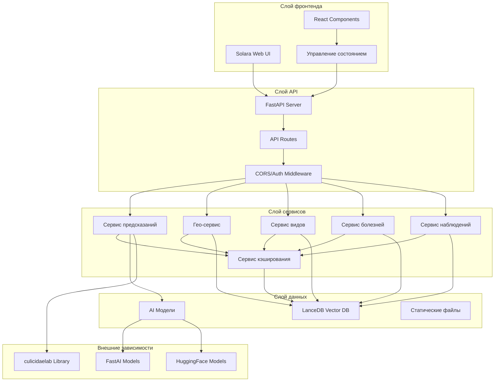
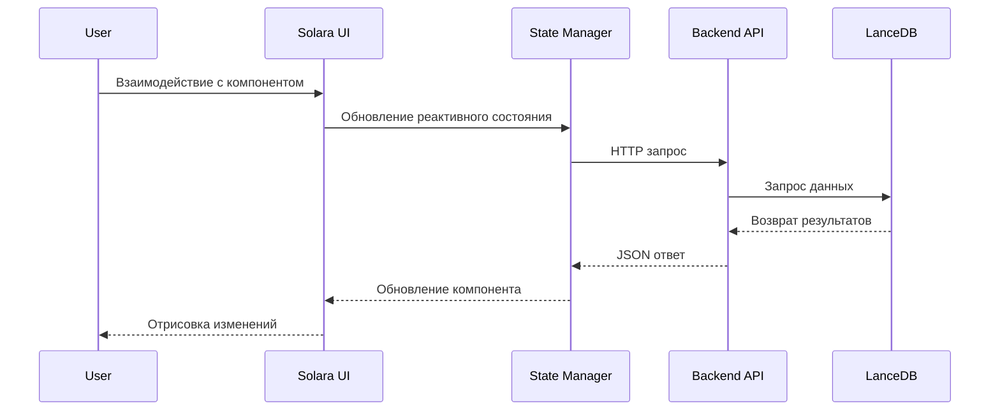
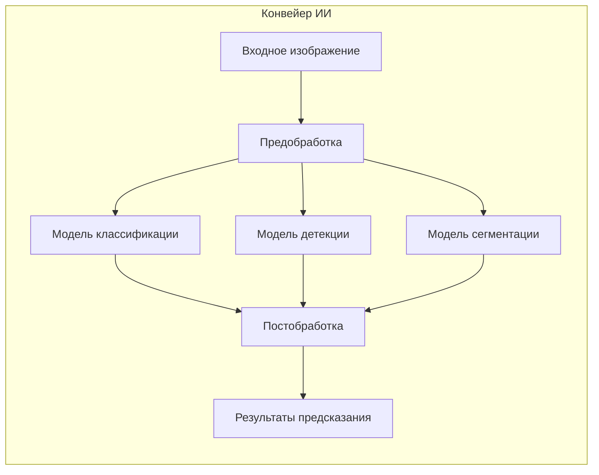
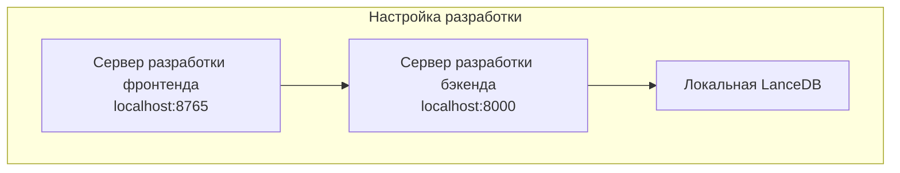
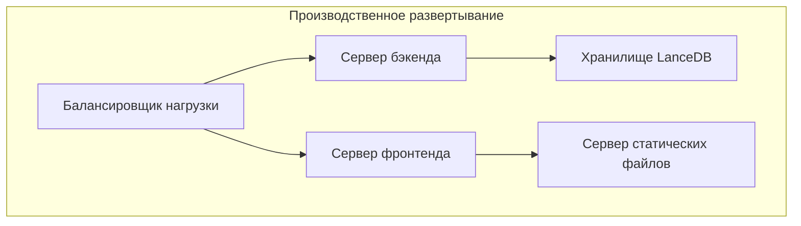

# Архитектура системы

Этот документ предоставляет всеобъемлющий обзор архитектуры CulicidaeLab Server, включая компоненты системы, поток данных и технические решения по проектированию.

## Обзор

CulicidaeLab Server — это полнофункциональное веб-приложение, построенное на современных Python-технологиях, предназначенное для исследования комаров, наблюдения и анализа данных. Система следует архитектуре, вдохновленной микросервисами, с четким разделением между компонентами фронтенда и бэкенда.

## Высокоуровневая архитектура



## Архитектура компонентов

### Архитектура фронтенда (Solara)

Фронтенд построен с использованием Solara, чисто Python реактивного веб-фреймворка, который компилируется в современные веб-технологии.

#### Ключевые компоненты:

- **Главное приложение** (`frontend/main.py`): Точка входа и конфигурация маршрутизации
- **Страницы** (`frontend/pages/`): Отдельные компоненты страниц для различных функций
- **Компоненты** (`frontend/components/`): Переиспользуемые UI компоненты, организованные по функциям
- **Управление состоянием** (`frontend/state.py`): Глобальное состояние приложения с использованием Solara reactives
- **Конфигурация** (`frontend/config.py`): Настройки фронтенда, темы и API endpoints

#### Поток данных фронтенда:



### Архитектура бэкенда (FastAPI)

Бэкенд следует паттерну слоистой архитектуры с четким разделением ответственности.

#### Структура слоев:

1. **Слой API** (`backend/routers/`): Обработчики маршрутов FastAPI
2. **Слой сервисов** (`backend/services/`): Бизнес-логика и обработка данных
3. **Слой схем** (`backend/schemas/`): Pydantic модели для валидации запросов/ответов
4. **Слой данных** (`backend/database_utils/`): Подключение к базе данных и утилиты запросов

#### Компоненты бэкенда:

- **Главное приложение** (`backend/main.py`): Инициализация и конфигурация FastAPI приложения
- **Конфигурация** (`backend/config.py`): Управление настройками с Pydantic
- **Зависимости** (`backend/dependencies.py`): Внедрение зависимостей для общих сервисов
- **Роутеры**: API endpoints для конкретных функций
  - `species.py`: Информация о видах и поиск
  - `diseases.py`: Данные о болезнях и связях с переносчиками
  - `prediction.py`: Предсказание видов с помощью ИИ
  - `geo.py`: Географические данные и наблюдения
  - `observation.py`: Управление пользовательскими наблюдениями
  - `filters.py`: Опции фильтров для UI компонентов

### Архитектура данных

#### Векторная база данных LanceDB

Система использует LanceDB в качестве основного хранилища данных, предоставляя:

- **Векторный поиск по сходству** для идентификации видов
- **Геопространственную индексацию** для запросов на основе местоположения
- **Поддержку эволюции схемы** для изменений модели данных
- **Высокопроизводительные запросы** с автоматической индексацией

#### Модели данных:

```python
# Основные структуры данных
Species {
    id: str
    scientific_name: str
    common_names: dict[str, str]
    description: dict[str, str]
    images: list[str]
    distribution: dict
    vector_embedding: list[float]
}

Observation {
    id: str
    species_id: str
    location: Point
    timestamp: datetime
    confidence: float
    user_id: str
    image_path: str
}

Disease {
    id: str
    name: dict[str, str]
    description: dict[str, str]
    symptoms: dict[str, str]
    vectors: list[str]
    prevention: dict[str, str]
}
```

## Интеграция ИИ/МО

### Архитектура модели

Система интегрируется с библиотекой `culicidaelab` для идентификации видов с помощью ИИ:



### Типы моделей:

1. **Модели классификации**: Идентификация видов по изображениям
2. **Модели детекции**: Обнаружение и локализация комаров
3. **Модели сегментации**: Точное определение границ комаров

### Соображения производительности:

- **Ускорение GPU**: Поддержка CUDA для более быстрого вывода
- **Кэширование моделей**: Предзагруженные модели для уменьшения задержки
- **Пакетная обработка**: Эффективная обработка множественных предсказаний
- **Механизмы отката**: Обработка на CPU при недоступности GPU

## Архитектура безопасности

### Аутентификация и авторизация

В настоящее время реализует базовые меры безопасности:

- **Конфигурация CORS**: Контролируемый доступ между источниками
- **Валидация входных данных**: Валидация схем Pydantic
- **Безопасность загрузки файлов**: Валидация типа и размера изображений
- **Ограничение скорости**: (Планируется) Ограничение API запросов

### Безопасность данных

- **Санитизация входных данных**: Все пользовательские входные данные валидируются
- **Предотвращение SQL-инъекций**: Параметризованные запросы через LanceDB
- **Безопасность файловой системы**: Контролируемые паттерны доступа к файлам
- **Переменные окружения**: Вынесение конфиденциальной конфигурации во внешние переменные

## Архитектура развертывания

### Среда разработки



### Производственная среда



## Соображения производительности

### Производительность фронтенда

- **Ленивая загрузка компонентов**: Загрузка компонентов по требованию
- **Оптимизация состояния**: Эффективные обновления реактивного состояния
- **Оптимизация ресурсов**: Сжатые изображения и статические файлы
- **Стратегия кэширования**: Кэширование браузера и CDN

### Производительность бэкенда

- **Индексация базы данных**: Оптимизированные индексы LanceDB
- **Пулинг соединений**: Эффективные соединения с базой данных
- **Асинхронная обработка**: Неблокирующие I/O операции
- **Кэширование ответов**: Кэшированные API ответы для статических данных

### Мониторинг и наблюдаемость

- **Логи приложения**: Структурированное логирование по всей системе
- **Метрики производительности**: Мониторинг времени ответа и пропускной способности
- **Отслеживание ошибок**: Всестороннее логирование и оповещение об ошибках
- **Проверки состояния**: Endpoints мониторинга состояния системы

## Сводка технологического стека

### Стек фронтенда
- **Solara**: Чисто Python веб-фреймворк
- **ipyleaflet**: Интерактивные компоненты карт
- **Plotly**: Визуализация данных
- **Material Design**: Библиотека UI компонентов

### Стек бэкенда
- **FastAPI**: Высокопроизводительный веб-фреймворк
- **Uvicorn**: ASGI сервер
- **Pydantic**: Валидация данных и настройки
- **LanceDB**: Векторная база данных
- **culicidaelab**: Библиотека ИИ/МО

### Инструменты разработки
- **uv**: Управление Python пакетами
- **pytest**: Фреймворк тестирования
- **Black**: Форматирование кода
- **mypy**: Проверка типов
- **pre-commit**: Git хуки для качества кода