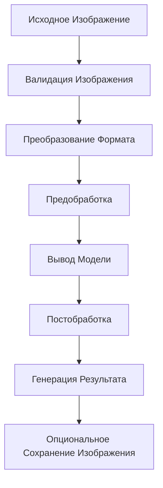

# ИИ Модели

Этот документ предоставляет исчерпывающую документацию архитектуры ИИ модели и конвейера предсказаний, используемых в CulicidaeLab Server для идентификации видов комаров.

## Обзор

CulicidaeLab использует сложный конвейер машинного обучения для автоматической идентификации видов комаров по изображениям. Система интегрирует Python библиотеку `culicidaelab` (версия ≥0.2.2) с FastAI (версия 2.7.0-2.8.0) для обеспечения точной классификации видов в реальном времени.

## Архитектура Модели

### MosquitoClassifier

Основным ИИ компонентом является класс `MosquitoClassifier` из библиотеки culicidaelab, который предоставляет:

- **Фреймворк Глубокого Обучения**: Построен на FastAI для надежной классификации изображений
- **Предобученные Модели**: Использует трансферное обучение от установленных моделей компьютерного зрения
- **Специфичное для Видов Обучение**: Обучен на курированных наборах данных изображений комаров
- **Оценка Уверенности**: Предоставляет распределения вероятностей по классам видов

### Конфигурация Модели

```python
class PredictionService:
    def __init__(self):
        self.model = None
        self.model_loaded = False
        self.lib_settings = get_settings()
        self.save_predicted_images_enabled = app_settings.SAVE_PREDICTED_IMAGES
```

#### Ключевые Параметры Конфигурации:
- **Архитектура Модели**: Настраивается через настройку `predictors.classifier.model_arch`
- **Веса Модели**: Загружаются из пути `predictors.classifier.filename`
- **Обработка Входных Данных**: Автоматическая предобработка и нормализация изображений
- **Формат Вывода**: Структурированные результаты предсказания с оценками уверенности

## Конвейер Предсказания

### Рабочий Процесс Обработки Изображений



### 1. Ввод и Валидация Изображения

```python
async def predict_species(self, image_data: bytes, filename: str):
    """Обработка данных изображения для предсказания видов."""
    image = Image.open(io.BytesIO(image_data)).convert("RGB")
    image_np = np.array(image)
```

**Требования к Входным Данным:**
- **Поддерживаемые Форматы**: JPEG, PNG и другие PIL-совместимые форматы
- **Цветовое Пространство**: Автоматическое преобразование в RGB
- **Ограничения Размера**: Настраиваемые максимальные размеры изображения
- **Качество**: Нет специфических требований к качеству (модель обрабатывает различные качества)

### 2. Конвейер Предобработки

Конвейер предобработки включает:

- **Нормализация Цветового Пространства**: Преобразование RGB и нормализация каналов
- **Изменение Размера**: Автоматическое масштабирование до входных размеров модели
- **Аугментация Данных**: Аугментация во время выполнения для улучшенной устойчивости
- **Преобразование Тензора**: Массив NumPy в формат, совместимый с моделью

### 3. Вывод Модели

```python
predictions = self.model.predict(image_np)
top_species, top_confidence = predictions[0]
```

**Процесс Вывода:**
- **Прямой Проход**: Единичный вывод через нейронную сеть
- **Распределение Вероятностей**: Softmax вывод по всем классам видов
- **Top-K Результаты**: Возвращает ранжированные предсказания с оценками уверенности
- **Производительность**: Оптимизирован для вывода в реальном времени (< 1 секунды обычно)

### 4. Обработка Результатов

```python
result = PredictionResult(
    scientific_name=top_species,
    probabilities={species: float(conf) for species, conf in predictions[:2]},
    id=species_id,
    model_id=self.model_id,
    confidence=float(top_confidence),
    image_url_species=image_url_species,
)
```

## Производительность Модели

### Метрики Точности

Производительность модели оценивается с использованием стандартных метрик классификации:

- **Top-1 Точность**: Процент правильных топ предсказаний
- **Top-5 Точность**: Процент случаев, когда правильный вид находится в топ 5 предсказаний
- **Калибровка Уверенности**: Соответствие между предсказанной уверенностью и фактической точностью
- **Производительность по Видам**: Метрики точности и полноты для каждого вида

### Оценка Уверенности

Система предоставляет калиброванные оценки уверенности:

- **Диапазон**: 0.0 до 1.0 (0% до 100% уверенности)
- **Интерпретация**: Более высокие оценки указывают на большую уверенность модели
- **Рекомендации по Порогам**: 
  - Высокая уверенность: > 0.8
  - Средняя уверенность: 0.5 - 0.8
  - Низкая уверенность: < 0.5

### Поддерживаемые Виды

Модель в настоящее время поддерживает идентификацию основных видов комаров, включая:

#### Виды Aedes
- *Aedes aegypti* (Комар желтой лихорадки)
- *Aedes albopictus* (Азиатский тигровый комар)
- *Aedes canadensis* (Канадский комар)
- *Aedes dorsalis* (Прибрежный комар каменных луж)
- *Aedes geniculatus* (Комар дупел деревьев)
- *Aedes koreicus* (Корейский кустарниковый комар)
- *Aedes triseriatus* (Восточный комар дупел деревьев)
- *Aedes vexans* (Внутренний комар паводковых вод)

#### Виды Anopheles
- *Anopheles arabiensis* (Арабский малярийный комар)
- *Anopheles freeborni* (Западный малярийный комар)
- *Anopheles sinensis* (Китайский малярийный комар)

#### Виды Culex
- *Culex inatomii*
- *Culex pipiens* (Обыкновенный домашний комар)
- *Culex quinquefasciatus* (Южный домашний комар)
- *Culex tritaeniorhynchus* (Комар японского энцефалита)

#### Виды Culiseta
- *Culiseta annulata* (Кольчатый комар)
- *Culiseta longiareolata* (Полосатый комар)

## Архитектура Интеграции

### Интеграция Слоя Сервиса

```python
class PredictionService:
    async def load_model(self):
        """Загрузка модели классификатора комаров."""
        self.model = MosquitoClassifier(self.lib_settings, load_model=True)
        self.model_loaded = True
        self.model_arch = self.lib_settings.get_config("predictors.classifier").model_arch
        self.model_id = self.lib_settings.get_config("predictors.classifier").filename.split(".")[0]
```

### Интеграция API

Сервис предсказания интегрируется с FastAPI бэкендом через:

- **Асинхронные Операции**: Неблокирующий вывод модели
- **Обработка Ошибок**: Комплексное перехватывание и отчетность об ошибках
- **Управление Ресурсами**: Эффективная загрузка модели и управление памятью
- **Кэширование**: Кэширование экземпляра модели для избежания накладных расходов на перезагрузку

### Конвейер Хранения Изображений

```python
async def save_predicted_image(self, image_data: bytes, filename: str):
    """Сохранение предсказанных изображений в нескольких разрешениях."""
    # Оригинальное разрешение
    # Миниатюра 224x224 (размер входа модели)
    # Миниатюра 100x100 (отображение UI)
```

**Функции Хранения:**
- **Мульти-Разрешение**: Автоматическая генерация нескольких размеров изображений
- **Асинхронная Обработка**: Неблокирующие операции сохранения изображений
- **Настраиваемость**: Включение/отключение через настройку `SAVE_PREDICTED_IMAGES`
- **Организованная Структура**: Иерархическая организация директорий по размеру

## Развертывание Модели

### Соображения для Продакшена

#### Оптимизация Производительности
- **Кэширование Модели**: Единичный экземпляр модели на сервис
- **Пакетная Обработка**: Поддержка пакетных предсказаний (будущее улучшение)
- **GPU Ускорение**: Поддержка CUDA при наличии
- **Управление Памятью**: Эффективная обработка памяти тензоров

#### Масштабируемость
- **Горизонтальное Масштабирование**: Дизайн без состояния позволяет множественные экземпляры
- **Балансировка Нагрузки**: Совместимость со стандартными стратегиями балансировки нагрузки
- **Мониторинг Ресурсов**: Отслеживание использования памяти и CPU
- **Автомасштабирование**: Контейнерное развертывание с ограничениями ресурсов

#### Надежность
- **Восстановление от Ошибок**: Грациозная обработка сбоев загрузки модели
- **Механизмы Отката**: Режимы деградированного сервиса для устойчивости системы
- **Проверки Здоровья**: Конечные точки мониторинга доступности модели
- **Логирование**: Комплексное логирование предсказаний для отладки

### Обновления Модели

#### Управление Версиями
- **Версионирование Модели**: Семантическое версионирование для релизов модели
- **Обратная Совместимость**: Стабильность API через обновления модели
- **A/B Тестирование**: Поддержка сравнения версий модели
- **Возможность Отката**: Быстрое возвращение к предыдущим версиям модели

#### Непрерывное Улучшение
- **Мониторинг Производительности**: Отслеживание точности предсказаний во времени
- **Сбор Данных**: Сбор отзывов пользователей для улучшения модели
- **Конвейер Переобучения**: Автоматизированное переобучение модели с новыми данными
- **Обеспечение Качества**: Валидационное тестирование перед развертыванием модели

## Будущие Улучшения

### Планируемые Улучшения

#### Возможности Модели
- **Многоэтапная Классификация**: Иерархическая классификация Род → Вид
- **Морфологические Признаки**: Интеграция обнаружения анатомических признаков
- **Распознавание Стадий Жизни**: Идентификация стадий яйца, личинки, куколки, взрослой особи
- **Определение Пола**: Возможности классификации самец/самка

#### Технические Улучшения
- **Векторные Вложения**: Анализ сходства и кластеризации видов
- **Квантификация Неопределенности**: Байесовские подходы для лучшей оценки уверенности
- **Активное Обучение**: Интеллектуальный выбор образцов для улучшения модели
- **Федеративное Обучение**: Распределенное обучение через исследовательские институты

#### Функции Интеграции
- **Обработка в Реальном Времени**: Возможности анализа потокового видео
- **Мобильная Оптимизация**: Развертывание на краю для полевых приложений
- **Версионирование API**: Множественные версии модели, доступные через API
- **Пользовательское Обучение**: Возможности тонкой настройки модели для конкретных пользователей